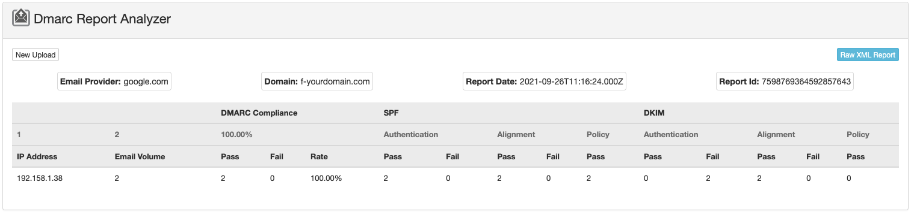

# Artifacts of the paper "Longitudinal Analysis of DMARC across country code Top-Level Domains"

Welcome to the software artifacts of the aforementioned paper. This repository provides resources needed to examine and reproduce our work.

Paper presented at [NOMS 2026](https://noms2026.ieee-noms.org/ieeeifip-network-operations-and-management-symposium-2026-121/events/ts-4-security-management).
Paper can be accessed [here](https://gustavoluvizotto.github.io/dmarc-aggr-report-dependency-tex/main.pdf).
[NOMS 2026](https://ieeexplore.ieee.org/xpl/conhome/1000491/all-proceedings) are not out yet.

## Description

Research project to investigate the characteristics of DMARC in terms of adoption and reporting from ccTLDs and governmental domains.

The artifacts are divided as follows:

- ``govdirectory-crawl``: A crawler to the ``https://www.govdirectory.org/countries/`` webpage. Saves the ``.tsv`` file for each country that is used later in the analysis to extract governmental domains.
- ``un-crawl``: A crawler to the ``https://publicadministration.un.org/egovkb/en-us/Resources/Country-URLs`` webpage. It extracts the government portals into a ``.csv`` file that is used in the analysis.
- ``notebooks``: There are 2 main Jupyter notebooks with analysis:
  - ``cluster-data-processing.ipynb``: This notebook runs in a cluster (requirements below). This notebook does the following:
    - extract gov labels from governmental domains
    - prepare input for new ZDNS measurements
    - integrate IP2Location data into our data set
    - performs 2 longitudinal analysis: DMARC adoption and DMARC external reporting
    - performs data set overview
    - extract the data to process and generate results for research questions 1 and 2 of this paper
    - performs data set verifications
    - **Note: ignore** the Graph related cells in this notebook as they did not generate output for this paper
  - ``process-results.ipynb``: This notebook runs in local machine (requirements below). This notebook uses the data extracted from the cluster and does the following:
    - identify stringent/permissive policies
    - investigate DMARC adoption in ccTLDs and government domains
    - investigate DMARC reporting in ccTLDs and government domains
    - **Note: ignore** the Graph related cells in this notebook as they did not generate output for this paper
- ``data``: contains a ``longitudinal_*.csv`` files relevant for the longitudinal analysis. This directory is where you should place the data set from Zenodo (see below). The data needs to be uncompressed.
- ``prepare.sh``: create the python virtual environment to use with the ``process-results.ipynb`` notebook

The file ``download_data.sh`` can be ignored as it is used by the authors to download data from the University's data center into local computer under ``data`` directory.

There are a few files in this repository that did not generate output to the paper.  Hence, they are present only for archival purposes. These are: ``neo4j``, ``iana-crawl``, ``convert_graph_parquet_data_to_csv.py``, ``docker-compose.yml``, ``import_graph_data.sh``, and ``start_container.sh``. You can safely ignore these.

## Requirements

We used 2 different environments to process and analyze the data set. The cluster environment and the local environment.

The cluster environment runs in a Spark cluster, with fine-tuned configurations. The cluster is capable to retrieve and process data from OpenINTEL, and save intermediate data to the University's data center. For OpenINTEL data access, we advise contact ``https://openintel.nl/contact/``. You **do not** need access to the University data center. You can modify all ``output`` paths and save to your own setup.

The local environment runs with python virtual environment. The local environment is a MacOS 26.0.1, with 8 cores and 16GB of RAM.

The cluster :

- Spark version 3.5.3
- Python 3.10.17 | packaged by conda-forge
- packages under ``external_packages`` directory
- OpenINTEL data (check on ``openintel.nl``)
- the data set archived in Zenodo

The local environment uses:

- Python 3.12.2
- all modules dependencies are installed within the ``process-results.ipynb``
- the data set archived in Zenodo

## Usage

To reproduce this work, we advise running first the ``cluster-data-processing.ipynb`` notebook, then the ``process-results.ipynb`` notebook.

## Data set

Publicly available when the paper becomes public too.
[DOI: 10.5281/zenodo.17607887](https://doi.org/10.5281/zenodo.17607887)

## Contact

For further information, please contact [gustavoluvizotto](https://github.com/gustavoluvizotto).

## DMARC aggregated report

DMARC aggregated reports provide a summary, in XML format, of DMARC results (pass and fail) of a given sending IP address, alongside SPF and DKIM. The RFC-7489 provides with the schema for the XML format. The RFC also provides with data exposure considerations for aggregated and forensics reports, where:

> Both report types may expose sender and recipient identifiers (e.g., RFC5322.From addresses), and although the [AFRF] format used for failed-message reporting supports redaction, failed-message reporting is capable of exposing the entire message to the report recipient.
-- [rfc7489#section-9.1](https://www.rfc-editor.org/rfc/rfc7489#section-9.1)

Here's a DMARC aggregated report example, extracted from ``https://www.mailercheck.com/articles/how-to-read-a-dmarc-report-and-actually-understand-it`` (see ``dmarc-aggr-report-example.xml`` for the raw file) and rendered using ``https://mxtoolbox.com/Public/Tools/DmarcReportAnalyzer.aspx``:

## Acknowledgment

- OpenINTEL project
- CATRIN project (NWA.1215.18.003)

## License

MIT License
